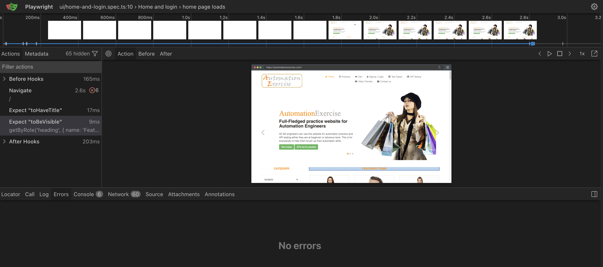

# playwright-typescript-framework

[](https://github.com/sailyjadhav/playwright-typescript-framework/actions/workflows/playwright.yml)

## Purpose

I am a QA Lead with 12 years of experience testing healthcare EHR systems. This is a Playwright and
TypeScript framework I built against a public demo shop, Automation Exercise, covering both its user
interface and its API. It shows how I design, review and defend an automation framework, not only
how I write tests: every pattern was introduced deliberately, broken on purpose to prove it works,
and every decision is written down with its reason and the alternative I rejected.

## How to run

Requirements: Node.js 22 and a free test account on [Automation Exercise](https://automationexercise.com).

```bash
git clone https://github.com/sailyjadhav/playwright-typescript-framework.git
cd playwright-typescript-framework
npm ci
npx playwright install --with-deps
cp .env.example .env   # then fill in BASE_URL and the test account
```

| Command                      | What it runs                                                              |
| ---------------------------- | ------------------------------------------------------------------------- |
| `npm run quality`            | Typecheck, lint and format check                                          |
| `npm run test:smoke`         | Six critical tests, one per area, on Chromium plus the API (about 10 s)   |
| `npm run test:api`           | API tests only, no browser                                                |
| `npm run test:ui`            | UI tests on Chromium, Firefox and WebKit                                  |
| `npm test`                   | Everything, including a test that creates and deletes a temporary account |
| `npx playwright show-report` | The HTML report of the last run                                           |

## Concept map

Each concept and the file that demonstrates it.

| Concept                                                         | Where to look                                                                              |
| --------------------------------------------------------------- | ------------------------------------------------------------------------------------------ |
| Quality gate: strict TypeScript, ESLint, Prettier               | `tsconfig.json`, `eslint.config.mjs`, `docs/quality-gates.md`                              |
| Configuration: `.env`, CI behaviour, failure evidence           | `playwright.config.ts`, `.env.example`                                                     |
| Semantic locators and web-first assertions                      | `tests/ui/home-and-login.spec.ts`                                                          |
| Page Object Model, with a component by composition              | `pages/LoginPage.ts`, `pages/HomePage.ts`, `components/Header.ts`                          |
| Custom fixtures                                                 | `fixtures/pages.ts`                                                                        |
| Data-driven tests and soft assertions                           | `data/login-cases.ts`, `tests/ui/invalid-login.spec.ts`, `tests/ui/product-search.spec.ts` |
| Authentication with a setup project and `storageState`          | `tests/auth.setup.ts`, `tests/ui/account.spec.ts`                                          |
| API testing (status and body)                                   | `tests/api/`, `fixtures/api.ts`, `utils/api-types.ts`                                      |
| Hybrid API and UI test with guaranteed cleanup                  | `tests/ui/hybrid-account.spec.ts`, `tempUser` in `fixtures/pages.ts`                       |
| Network control: blocking third parties, abort, waitForResponse | `blockThirdPartyRequests` in `fixtures/pages.ts`, `tests/ui/network.spec.ts`               |
| Tags, smoke set and run scripts                                 | `utils/test-tags.ts`, `package.json` scripts                                               |
| CI with GitHub Actions                                          | `.github/workflows/playwright.yml`                                                         |
| Accessibility (axe, scoped and baseline)                        | `tests/ui/accessibility.spec.ts`                                                           |

## Folder structure

```text
.github/workflows/   CI pipeline
components/          Parts shared by pages (the header)
data/                Typed test data
docs/                Decisions, interview questions, investigations, quality gates
fixtures/            Custom fixtures for UI tests (pages.ts) and API tests (api.ts)
pages/               Page objects
tests/api/           API tests (no browser)
tests/ui/            UI tests
tests/auth.setup.ts  Logs in once and saves the browser state
utils/               Shared types
```

## A failure, investigated and fixed

A test that checked product images was flaky: in 10 runs it passed 3 times, was flaky 5 times and
failed 3 times. The trace showed the assertion giving up after 1 second while the image requests
were still loading. Removing the test's own 1-second timeout, so the project's 5-second setting
applied, made it pass 10 out of 10 with retries off. Full write-up:
[docs/failure-investigations.md](docs/failure-investigations.md).



## Key decisions

- **Block third-party requests.** A slow advertising request made the logged-in test fail in 4 of
  4 runs on Chromium; allowing only the site under test made it pass 5 of 5.
- **Check the API body, not just the status.** This API returns HTTP 200 even for errors and puts
  the real result in `responseCode`, so a status-only check would pass on every failure.
- **A smoke set of one test per critical area.** Six tests run in about 9 seconds against 51 for
  the full suite, giving fast feedback on every push while regression still covers everything.
- **Logged out by default, logged-in tests opt in.** Most tests check the login form, which must
  start logged out, so one opt-in is safer than opting out every other file.
- **Data-changing tests run deliberately.** The test that creates and deletes a real account is
  tagged and left out of pull-request runs, so CI never changes real data on every push.

Every decision, with its reason and the rejected alternative, is in
[docs/decisions.md](docs/decisions.md). Interview practice questions are in
[docs/interview-questions.md](docs/interview-questions.md).

## How this was built

Built with Claude Code as a pair programmer; design decisions, review, and test oracles are mine.
